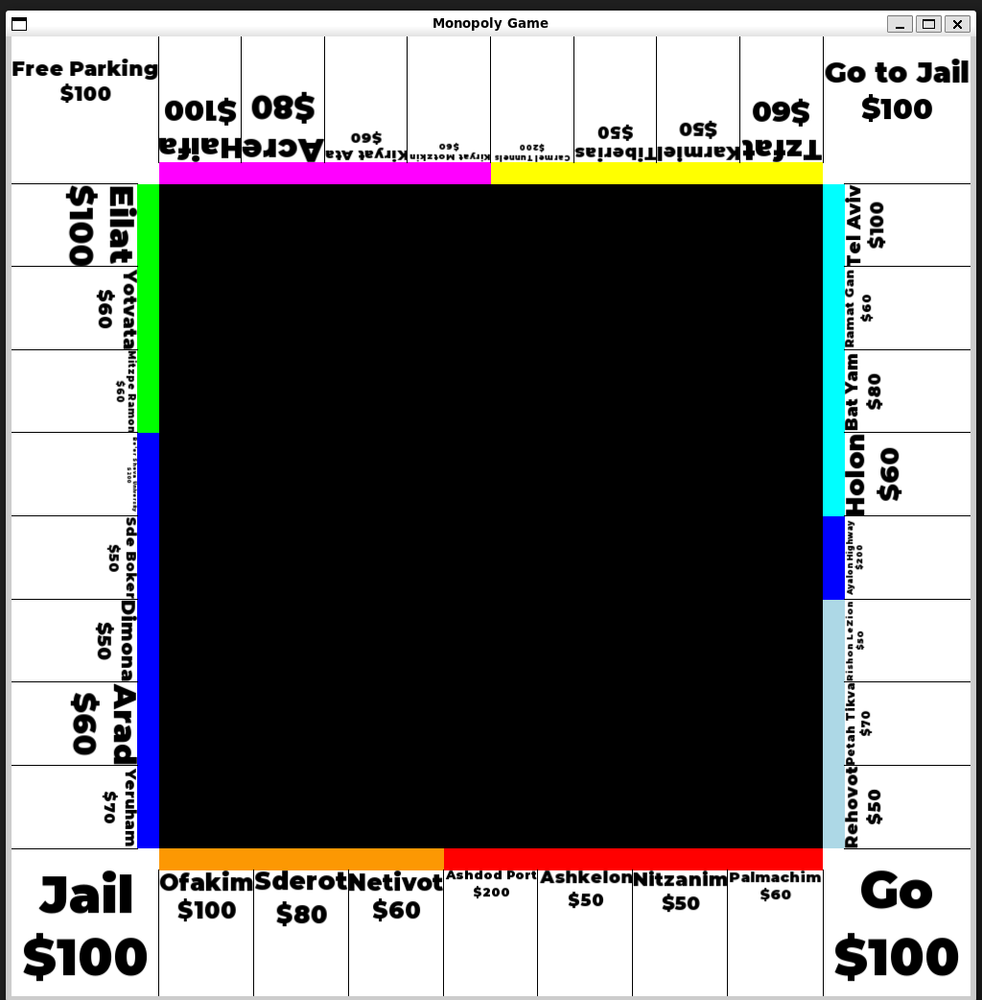

# Monopoly Game

This project is an attempt to create a digital version of the classic Monopoly board game using C++ and the SFML library for graphics rendering.

## Project Structure

The project is organized as follows:

## The Monopoly Board:
<!--  -->


## Building the Project

To build the project, you can use the provided `makefile`. Simply run the following command in the terminal:

```sh
make
```

To run the project, you can run it by the following command:
```sh
./MonopolyGame
```